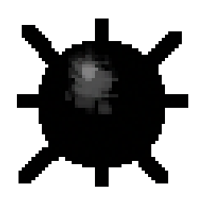
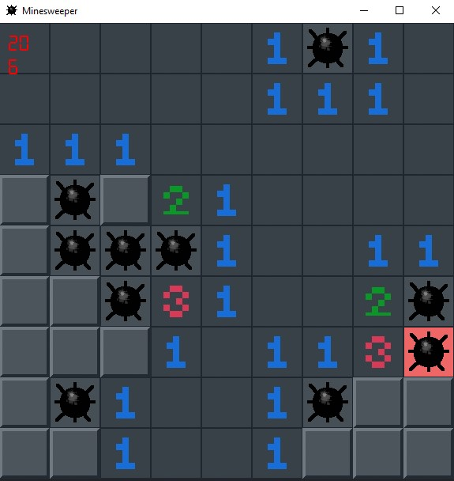

# Minesweeper (Simple C++ & SFML Project)

[Minesweeper](https://en.wikipedia.org/wiki/Minesweeper_(video_game)) is a logic puzzle video game genre generally played on personal computers. The game features a grid of clickable tiles, with hidden "mines" (depicted as naval mines in the original game) scattered throughout the board. The objective is to clear the board without detonating any mines, with help from clues about the number of neighboring mines in each field.




# CMake SFML Project Template

This repository is based on CMake SFML project [template](https://github.com/SFML/cmake-sfml-project).
All CMake script files are written by default in the template. Just knew how to use a github repo template, used the template, built the project using CMake and started coding!

# How to install

## Simple Way

<!-- [Download the game](https://github.com/KeroWagdy100/minesweeper/releases/download/v1.0.0/minesweeper.zip) and start playing! -->
[Download the repo](https://github.com/KeroWagdy100/minesweeper/archive/refs/heads/master.zip), open donwload folder, click on minesweeper.exe and start playing! (anything outside download folder can be deleted, they're not requried)

-- !! (CAUTION: In general, opening a .exe file is dangerous unless from a trusted source) !!


## Hard Way
you can clone the repo or directly donwload it, build the project yourself and start playing.

- [CMake](https://cmake.org/download/) V3.28.0 Required.
- [SFML](https://www.sfml-dev.org/download/) V3.0.0 Required (CMake fetches it in the script, you don't have to install it yourself).

Once you have game files on your system:

- Open your favourite code editor or any IDE and figure out how to use CMake on it. Most popular IDEs support CMake projects with very little effort on your part.

   - [VS Code](https://code.visualstudio.com) via the [CMake extension](https://code.visualstudio.com/docs/cpp/cmake-linux)
   - [Visual Studio](https://docs.microsoft.com/en-us/cpp/build/cmake-projects-in-visual-studio?view=msvc-170)
   - [CLion](https://www.jetbrains.com/clion/features/cmake-support.html)
   - [Qt Creator](https://doc.qt.io/qtcreator/creator-project-cmake.html)

- Use CMake to build the game. Using CMake from the command line is straightforward as well.
   Be sure to run these commands in the root directory of the project you just created.

   ```
   cmake -B build
   cmake --build build
   ```

- After the build, you can start the game by openning the [.exe](https://en.wikipedia.org/wiki/Executable) found in 
   ```
   gameDir/build/bin/main.exe
   ```

Here are some useful resources if you want to learn more about CMake:

- [Official CMake Tutorial](https://cmake.org/cmake/help/latest/guide/tutorial/)
- [How to Use CMake Without the Agonizing Pain - Part 1](https://alexreinking.com/blog/how-to-use-cmake-without-the-agonizing-pain-part-1.html)
- [How to Use CMake Without the Agonizing Pain - Part 2](https://alexreinking.com/blog/how-to-use-cmake-without-the-agonizing-pain-part-2.html)
- [Better CMake YouTube series by Jefferon Amstutz](https://www.youtube.com/playlist?list=PL8i3OhJb4FNV10aIZ8oF0AA46HgA2ed8g)

# Objectives And Basic Concepts
The objective in Minesweeper is to find and mark all the mines hidden under the grey squares, in the shortest time possible. This is done by clicking on the squares to open them. Each square will have one of the following:

- A mine, and if you click on it you'll lose the game.
- A number, which tells you how many of its adjacent squares have mines in them.
Nothing. In this case you know that none of the adjacent squares have mines, and they will be automatically opened as well.

- It is guaranteed that the first square you open won't contain a mine, so start by clicking on any square.
Often you'll hit on an empty square on the first try and then you'll open up a few adjacent squares as well, which makes it easier to continue. Then it's basically just looking at the numbers shown, and figuring out where the mines are.

## Gameplay

*copied from [cardgames.io/minesweeper](https://cardgames.io/minesweeper/)

There are essentially five actions you can take in Minesweeper:

- Open a square. This is done simply by left clicking on a square.
- Marking a square as a mine. This is done by right clicking on a square. A little mine icon will show up there.

- Clear any marks. Again, right click on the square.

- Opening all remaining adjacent squares to a number square. If for example you have a square with the number 1 and you have already marked one mine in one of the adjacent squares you can left click on the 1 square and the remaining adjacent squares will all be opened. This can save a lot of time while trying to quickly clear out squares. If you press on a number where not all adjacent mines have been marked, e.g. the number is 3 and you've only flagged one adjacent square, then the squares will not be opened, to prevent you from accidentally clicking on a number and blowing yourself up! In the old Windows version of this game you used both mouse buttons together to perform this action, but here we just use a normal left-click.

## License

### CMake and SFML License
The source code is dual licensed under Public Domain and MIT -- choose whichever you prefer.

### My License
I don't know, just whataver you want
